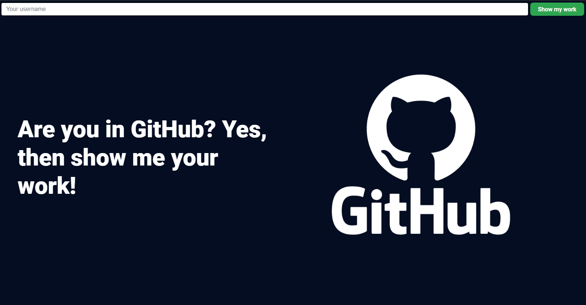

# Projeto DIO - FontEnd com ReactJS

# Descrição

Aplicação web desenvolvida em [ReactJS](https://reactjs.org/) e consumindo a API do GitHub utilizando a biblioteca Axios;

- Especialista: Matheus Benites
- Repositório Base: https://github.com/benits/github-api-interface
- Playlist do projeto: https://www.youtube.com/playlist?list=PLTv2Rbwcr_Cru7KIHcffE1Shg9X9Eix7a

# Conceitos Abordados

- **Componentização de Interface**: Divisão da interface em componentes menores que facilitam a reutilização, manutenção e testabilidade de cada parte separada.
- **Modularização**: Estrutura modular, facilitando a importação das partes necessárias e mantendo o código mais limpo e légivel.
- **Segregação de Responsabilidade**: Utilizando o Princípio da Responsabilidade Única para criar componentes.
- **Hooks**: Recurso utilizado para facilitar a criação dos componentes sem a necessidade de criar classes.
- **Testes Unitários**: Desenvolvimento de testes para garantir a qualidade do código durante sua evolução.

# Comandos da CLI

### `yarn create react-app 19_github-app`

Cria o projeto inicial utilizando o [Create React App](https://github.com/facebook/create-react-app).

### `yarn start`

Utilizado para rodar a aplicação em modo de desenvolvimento. Para ver a aplicação no browser, basta acessar [http://localhost:3000](http://localhost:3000).

### `yarn test`

Utilizado para rodar os testes desenvolvidos em modo iterativo.